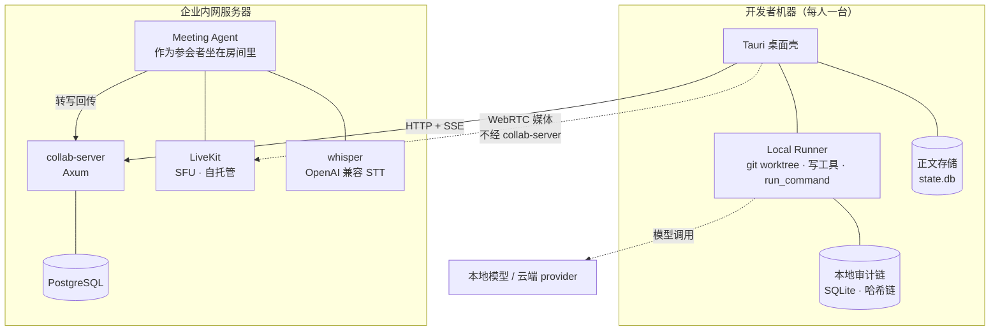
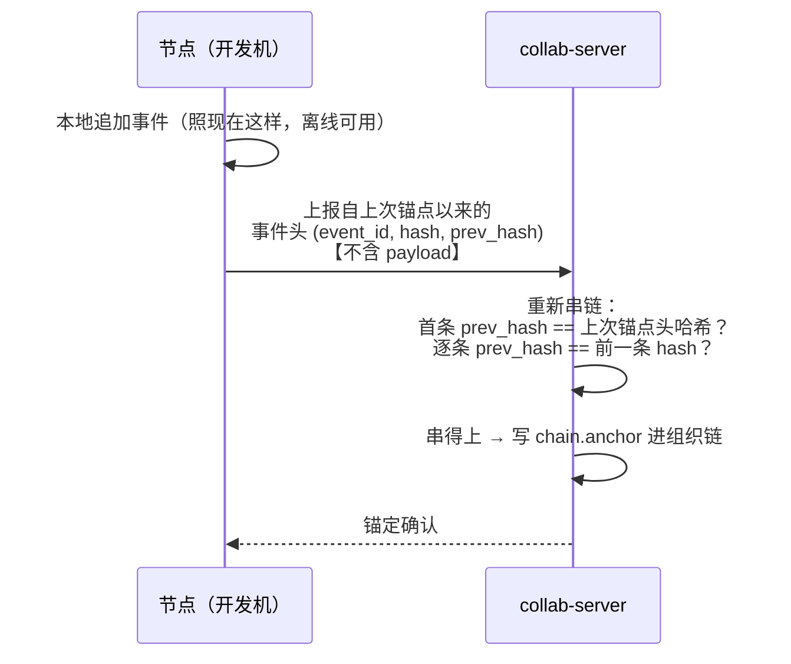
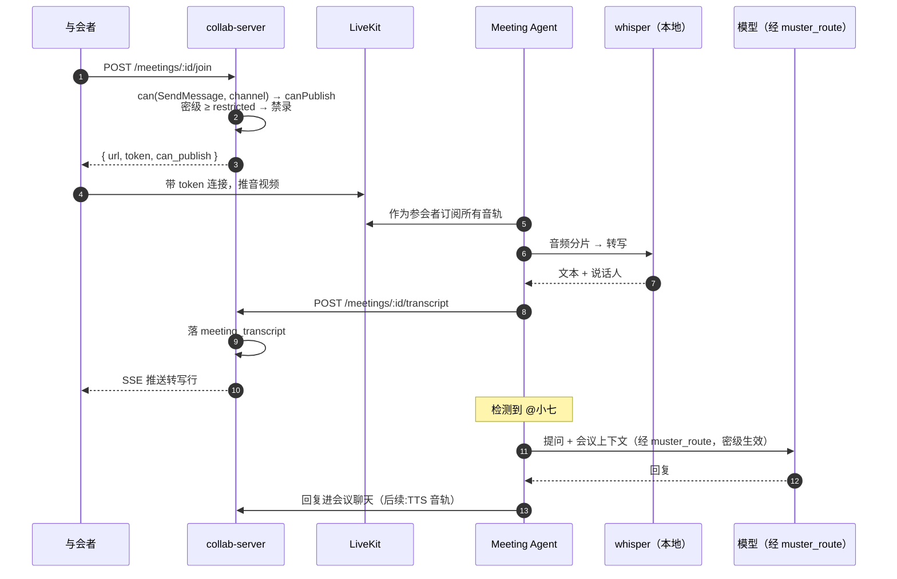
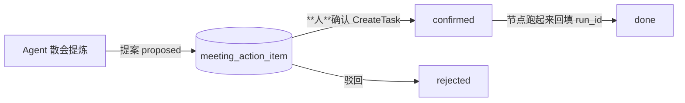

# Muster 服务端架构

> 状态:P2/P3 施工中。**本文是施工依据**——改服务端前先读它,改完回来更新它。
> 与总体规划的关系:总体规划定的是 16 周节奏,本文定的是服务端的具体形态与边界。

## 0. 一句话

**把单机的点将台变成一个组织能共用的点将台,而不把主权让出去。**

具体到工程上,这句话拆成五条硬边界(第 2 节),它们是本文其余部分的来源。
凡是与这五条冲突的实现,不管多方便,都是错的。

---

## 1. 部署拓扑

**关键读法**:媒体流(实线到 LiveKit)和业务流(到 collab-server)是**两条独立的路**。
音视频不绕经业务服务,业务服务也不碰音视频。它们只在"入会令牌"这一点上交汇。

| 组件 | 位置 | 职责 | 不做什么 |
|---|---|---|---|
| Tauri 桌面壳 | 开发者机器 | UI、本地 Runner、本地审计链 | — |
| collab-server | 内网服务器 | 身份、组织、消息、审批裁决、会议元数据 | **不碰源码、不碰音视频** |
| PostgreSQL | 内网服务器 | 服务端所有持久化 | 不存审计链(见边界三) |
| LiveKit | 内网服务器 | 音视频 SFU | 不做业务判断 |
| whisper | 内网服务器 | 语音转文本 | **绝不换成云端 API** |
| Meeting Agent | 内网服务器 | 作为参会者听会、转写、应答 | 不自己决定密级 |

---

## 2. 五条硬边界

### 边界一:服务端不持有源码

代码、worktree、diff 全部留在开发者机器上。服务端只知道「有一份 diff,哈希是 X,在节点 Y 上」。
审批在服务端裁决,**合入由持有那份 worktree 的节点执行**。

*为什么*:这是"本地部署"最实的一层。源码不上服务器,服务器被攻破也拿不到代码;
Runner 不需要凭据下发,P2-09 的 Service Account 大幅简化。

*已知冲突*:**审批人要看 diff**。三条路,尚未定:

| 方案 | 代价 |
|---|---|
| a. 服务端中转 diff | 服务端就持有代码了(可套上正文治理:密级 + 保留期 + 删除) |
| b. 节点间直传,服务端撮合 | 需要 NAT 穿透;开发机不在线就看不了 |
| c. 推到组织已有的 GitLab/Gitea,Muster 治理那个 MR | 最现实(企业本就有 git 服务器,规划的非目标也写了"不自研 Git 引擎");代价是 Muster 从"执行合并的人"退成"决定能不能合的人" |

倾向 c,但它会改动已跑通的审批流,**留到消息层稳定后再定**。

### 边界二:权限判定不在服务端重写

`muster_identity::can()` 是纯函数内核(13,500 组穷举验证)。服务端只做一件事:
**把 HTTP 请求如实翻译成 `Principal` + `Action` + `Scope`**,判定仍归内核。

*为什么*:判定一旦有两份实现,「桌面端说能、服务端说不能」这种问题永远查不清。

*落地形态*:`org::require(db, identity, action, target)` 是唯一的授权闸,
所有写操作在**动数据库之前**过它。角色绑定**实时查库,不进 JWT**——
令牌 12 小时有效,把角色烤进令牌等于降权要等 12 小时才生效。

### 边界三:审计链留在节点,服务端只锚定

> **补充:服务端本身也是一个节点。** 权限变更、审批裁决这些事发生在服务端,
> 不属于任何一台开发机——所以服务端有自己的链,而**组织链就是它那条链**,
> 节点锚点将来也记在这里。链仍用 `muster_audit`(SQLite),不搬进 PostgreSQL:
> 一份实现、一套已验证过的哈希链代码,比再写一遍 PG 版可靠;
> 而它的写入量(权限变更、审批、锚点)本就极低。

**服务端不做全局链。** 每次 append 一次网络往返、且必须串行化;
再叠上铁律「审计写失败即任务失败」,结论就是**断网即不能干活**——
而 Runner 就在开发机上,机房网络抖一下全组织任务同时停摆。

组织级防篡改由**节点链 + 服务端锚定**解决:

**值钱的性质**:组织能证明链没被动过,却**看不见链里写了什么**。
事件头约 100 字节/条,一天几千条也就几百 KB。

两个必须配套的东西:

1. **锚点要签名**。否则谁都能伪造一个"我很干净"的锚点。
   节点入网时注册公钥——这与 P2-09(Runner Service Account / mTLS)是同一件事。
2. **关键动作前强制锚定**。合入审批落到组织侧之前先逼节点锚一次,
   **在最要紧的地方把窗口收到零**。

*诚实边界*:两次锚定之间节点仍可改写自己的历史。锚点只保证"锚定之前的部分改不了了"——
**锚定间隔就是篡改发现窗口**。

*与既有不做项的关系*:`muster-audit/README.md` 写着「多节点**合并**不做(ULID 按单节点设计)」。
本方案不与它冲突:锚定是保持多条链**各自独立**,不是合并成一条;每条链内部仍是单节点单调 ULID。

### 边界四:媒体面不自建

音视频交给自托管的 LiveKit(Apache-2.0)。回声消除、抖动缓冲、带宽自适应、NAT 穿透
是一门专业手艺,自建是 6 个月起步,做完也只是追平一个已被解决透的问题。

**准入仍归 Muster**:LiveKit 令牌里的 `canPublish` 不是配置项,是 `can()` 判定结果的
直接映射;会议密级 ≥ restricted 时 `roomRecord = false`——录像是长期留存、
极易被搬走的正文,高密级会议连"能不能录"都不该是与会者的选择。

### 边界五:转写必须走本地 provider

**这一条不许"先跑通再说"。**

会议音频是全系统密级最高的数据流,而转写就是一次模型调用。若走云端 STT:

- 铁律 2「绝不静默升云」当场破;
- 铁律 4 的外发记账破——**演习报告会说「零外发」,而整场会议音频都出去了**。

*落地形态*:whisper 起一个 OpenAI 兼容端点,注册成 `Locality::Local` 的 provider,
经 `muster_route` 决策后调用。**服务端的 `/transcript` 只收文本**,音频转文本必须在
调用方完成——这样服务端结构上就无从绕过密级路由。

演习模式下云端 STT 会被 fail-closed 直接拒掉,是现有骨架免费给的。

---

## 3. 数据模型

全部在 `muster-server/migrations/0001_init.sql`。命名与 `muster-identity` 的语义一一对应,
免得服务端和内核各说各话。

| 表 | 作用 | 要点 |
|---|---|---|
| `account` | 账号 | `ext_iss`/`ext_sub` 预留给 OIDC(P2-04),当前为空 |
| `team` / `channel` | 组织结构 | `channel.level` 与 `Sensitivity` 同源 |
| `role_binding` | 角色绑定 | 作用域三选一,与 `RoleBinding` 逐字段对应 |
| `channel_member` | 频道成员 | |
| `message` | 消息 | `channel_seq` 见下 |
| `channel_cursor` | 每频道发号器 | 单独一行做行锁,**不用 `MAX(seq)+1`** |
| `meeting` | 会议元数据 | `level` 只升不降;`room` 是 LiveKit 房间名 |
| `meeting_participant` | 参会记录 | |
| `meeting_transcript` | 转写正文 | **正文存储侧**:可导出、可按保留期删除 |

### channel_seq 是投递序,不是证据序

别拿一个去实现另一个:

| | 证据序 | 投递序 |
|---|---|---|
| 在哪 | 各节点的 `muster_audit` 哈希链 | `message.channel_seq` |
| 要求 | 防篡改、严格线性 | 每频道单调无空洞 |
| 用途 | 追责、验真 | 断线补拉(靠"无空洞"判断有没有漏收) |

发号走 `channel_cursor` 的 `UPDATE ... RETURNING` 行锁,并与 INSERT 同事务——
拿到号却没插进去会留下空洞,而补拉正是靠无空洞判断的。

---

## 4. API 面

已实现的加 ✅,计划中的加 ☐。

| 端点 | 说明 |
|---|---|
| ✅ `GET /health` | 免鉴权 |
| ✅ `POST /auth/login` | 账号不存在与口令错**回同一句话**,否则接口就是账号枚举器 |
| ✅ `GET /whoami` | 带 `can` 字段,前端据此禁用按钮而不是点了才报错 |
| ✅ `GET/POST /teams` `/channels` `/accounts` `/roles` | 组织管理,全过 `require()` |
| ✅ `GET/POST /channels/:cid/messages` | 支持 `?after_seq=` 补拉 |
| ✅ `GET/POST /channels/:cid/meetings` | 建会议,密级继承频道 |
| ✅ `POST /meetings/:mid/join` | 拿 LiveKit 令牌;能力由 `can()` 决定 |
| ✅ `POST /meetings/:mid/transcript` | **只收文本** |
| ✅ `POST /meetings/:mid/level` | 只升不降 |
| ✅ `POST /meetings/:mid/end` | |
| ✅ `GET /accounts` `GET /roles` | 列账号 / 列角色绑定——**看不见就管不了** |
| ✅ `DELETE /roles` | 撤销角色;**最后一个组织所有者撤不掉** |
| ✅ `POST /accounts/:aid/disabled` | 停用/启用(不删除:删了历史里的作者会变孤儿) |
| ✅ `GET/POST /meetings/:mid/action-items` | 会议行动项;**Agent 只能提案** |
| ✅ `POST /action-items/:aid/decide` | 确认/驳回——**授权动作,必须由人** |
| ✅ `POST /action-items/:aid/run` | 回填 run_id;**只有已确认的才能关联** |
| ☐ `GET /channels/:cid/events` | SSE 实时通道(见第 5 节),替换现有 `/ws` |
| ☐ `POST /nodes/:id/anchor` | 节点链锚定(边界三) |
| ☐ `GET/POST /approvals` | 审批裁决落服务端 |

只有 `/health` 与 `/auth/login` 免鉴权。其余 handler 的参数表里都有 `auth::Identity`——
**忘了写就拿不到身份**,让"忘记鉴权"在类型上尽量难发生,而不是靠中间件配置对不对。

---

## 5. 实时通道:SSE,不是 WebSocket ✅

已落地(C2)。`/ws` 暂留供过渡,**迁完即删**。

理由不是偏好,是 **`Last-Event-ID` 白送断线补拉**:客户端重连时浏览器自动带上
最后收到的事件 id,服务端从 PostgreSQL 重放之后的事件即可。`EventSource` 还自带
重连退避。WebSocket 要自己写这套逻辑——凭空多一堆容易出错的代码,而它正是
`lib.rs` 诚实边界里列着的欠账。

设计要点:

- **事件 id 由服务端分配**,客户端时间戳一律不信——服务器是唯一定序者。
- **事件 id 用全局 `stream_seq`,不用 `channel_seq`**:一条连接复用多频道时,
  单个 `Last-Event-ID` 表达不了多个频道的位置。
- **序号不用 `BIGSERIAL`**:序列号在事务外分配,拿到 5 的事务可能比拿到 6 的
  晚提交,消费者按 `> last` 拉取会**永久跳过 5**(outbox/CDC 的经典坑,丢的是消息)。
  改用单行游标 + `UPDATE ... RETURNING`:锁持有到提交,**加锁顺序即提交顺序**。
  代价是消息插入全局串行,团队规模下不值一提。有一条 60 路并发的测试锁住它
  (`tests/stream_order.rs`,需要活的 PostgreSQL,默认 `#[ignore]`)。
- **一条连接多路复用所有频道**,事件里带 `channel_id` 由客户端筛。
  一频道一连接会撞上 HTTP/1.1 每源约 6 个并发连接的上限(当前 WS 实现就有这个毛病)。
- **上行走 POST**,不走这条通道。同一个动作有两条路径就会有两套鉴权。
- 会议的双向低延迟信令是 **LiveKit 的活**,不是这条通道的活——所以 SSE 单向不构成问题。

---

## 5.5 管理工具:CLI,不是网页后台

服务端**没有图形化管理后台**,这是取舍不是欠账:

- 管理工作要能**脚本化**——开二十个账号、批量授权,循环一行就完了;
- 网页后台是第三个客户端、第二套会话管理,**新增攻击面而不新增能力**;
- 管理员本来就坐在服务器上,SSH 进去就能用;
- 本仓已有这个惯例(`examples/approve.rs`、`examples/live_task.rs`)。

`muster-server/examples/admin.rs` 覆盖:登录、列账号/角色、建号、授权、
**撤销**、停用/启用、建团队/频道。桌面壳接上服务端后会再有一套图形化编制
管理,两者走**同一套 HTTP 接口**,不会出现"只有某一边能干的事"。

### 权限变更必须留痕

`badge.update` 事件:谁改的(`changed_by`)、改了谁(envelope 的 actor)、
改成什么(哈希)。**撤销一个不存在的绑定也记**——"有人试图撤销某个绑定"
同样是信息。

一个讲治理的系统,如果"改谁能干什么"这件事悄无声息地发生,那它讲的治理就是空的。

## 5.6 桌面壳接服务端时,什么上去、什么不上去(C1)

| | 在哪 | 为什么 |
|---|---|---|
| Runner / worktree / diff | **本地** | 边界一:服务端不持有源码 |
| 审计链 | **本地** | 边界三:断网即停工对本地优先的产品是致命的 |
| 身份、团队、频道 | 服务端 | 本就是全组织共享的东西 |
| 团队频道的消息 | 服务端 | 同上——别人看得见才叫团队 |
| **个人频道的消息** | **本地,永不上传** | 见下 |

### 个人频道为什么连上服务器也不上传

界面上写着「内容默认不进团队,不出现在任何频道与检索里」。这是对使用者的
**承诺**,不是当前实现的副作用。一旦接上服务器就顺手把私有会话同步上去,
那句话当场变成假话——**而使用者是照着那句话决定往里说什么的。**

### 未配置服务器时一切照旧

`Remote` 是 `Option`。没配就是原来的单机点将台,一行行为都不变。
**单机不是"没连上",是一种正常形态**——所以连接状态条上写的是"单机模式",
不是"离线""未连接"这类带缺陷意味的词。

### 服务端写失败不静默降级到本地

那会让人以为发到了团队、其实只存在自己机器上——**比发不出去更糟**。
失败就报错,让界面显出来。

## 6. 审计写入:单写者 actor

`AuditStore::append` 的形状是「读上一条 hash → 插入新行」。在**单个实例内**,
`&mut self` 已由借用检查串行化;风险是服务端用连接池后出现**多个实例指向同一份存储**,
两个实例读到同一个 `prev_hash` 就会分叉。

**服务端只允许一个写者**:开一个 tokio 任务独占写入,其余通过 mpsc 投递写请求。
链的完整性在并发下自动成立,不靠调用方自觉。

---

## 7. 会议链路(端到端)

### Meeting Agent 用 Rust(**已定**)

理由是架构上的,不是审美上的:**边界五要求转写发生在能跑 `muster_route` 的
进程里**。Python sidecar 做不到——它只能反过来调服务端的转写接口,
那样服务端就持有音频了,「服务端不代劳」当场塌掉。

代价照实说:LiveKit 的 Agents 框架(Python)把音频帧、VAD、打断处理都做好了,
Rust 侧这一层要自己写。这是为守住边界五付的价钱。

> SDK 的实际接口形状见 **`docs/A1-livekit-探针结论.md`**(A1 探针)。三条要点:
> SDK 能按调用方指定的采样率/声道数直接出帧(16k 单声道白拿,不用自己重采样);
> 每个参会者各一条轨且订阅事件带 participant(**说话人归属不需要声纹分离**);
> 代价是构建期要从 GitHub 拉 100MB+ 的预编译 WebRTC——内网部署必须先解决。

### 转写这条链已经落地的部分

| 件 | 位置 | 作用 |
|---|---|---|
| `SpeechProvider` / `SpeechCompatProvider` | `muster-provider/src/speech.rs` | OpenAI 兼容 `/audio/transcriptions`;带 `Locality`,是外发咽喉的一部分 |
| `SpeechRouter` | `muster-route/src/speech.rs` | **复用同一个 `decide()`**,不另写判定 |

`SpeechRouter::resolve` 要求传入**对话路由此刻用的同一份 `OrgPolicy`**
(`Router::policy_snapshot()`)。这不是为了灵活,是防两侧策略漂移:
演习一开,对话锁本地而转写还在往云端发,演习报告就成了一句谎话。
已有测试锁住四条:演习拒云端 STT、演习仍放行本地 STT、restricted 永不上云、
一个 STT 都没配时如实拒绝而不是静默跳过转写。

记账口径:**按请求体算,不按回复算**——音频比文本大几个数量级。

### 行动项:提案与授权是两件事

会上一句话**不能直接变成在别人机器上跑的代码改动**:

- **转写会出错**——实测把"幂等键"转成"蜜等键";一个转错的行动项直接开跑,
  跑出来的东西没人看得懂为什么;
- **会议发言是低保真输入**——在会上说"这个回头改一下",和在任务框里写下一条
  明确需求,是两种强度的意图;
- **Runner 在开发者机器上**(边界一)——服务端的 Agent 本来也跑不了任务。

所以人确认那一步不是流程负担,是**授权边界**:

四条闸,真机验过:Agent 不能确认自己提的事;未确认不能关联运行;
重复裁决被拒;**确认与驳回都进审计链**(`approval.decision`,正文只留哈希)。

每条行动项都带 `source_quote`(出处原话)——人要能核对"它是不是听岔了"。

### 客户端用 JS SDK,Agent 用 Rust SDK——不是不一致,是约束相反

| | SDK | 为什么 |
|---|---|---|
| Meeting Agent | Rust | 无头进程,**转写必须在能跑 `muster_route` 的进程里**(边界五) |
| 桌面壳 | JS(webview) | webview 本来就是浏览器,自带 WebRTC / `getUserMedia` / `<video>`;用 Rust SDK 反而要把音视频帧再喂回 webview |

桌面壳因此**不引入原生 WebRTC 依赖**(那是 100MB 下载 + 1GB 构建产物,见 A1 文档)。

### 前端不自己判权限

入会票里的 `can_publish` 是服务端 `can()` 的判定结果,前端照着它决定要不要
显示开麦按钮。前端自己判一遍等于把权限内核复制了一份——两份实现迟早会分叉。

### macOS 上两条只有真跑才会暴露的

- `Info.plist` 缺 `NSMicrophoneUsageDescription` ⇒ 开麦时应用**直接被系统杀掉**
  (不是报错,是崩溃),编译期毫无征兆。与 A4 里的 `-ObjC` 同一类坑。
- Tauri 的 CSP **保持 `null`**:服务器地址由用户在登录框里填(可能是任意内网
  地址),写死白名单等于只能连一台。

### 会议密级棘轮

会中有人共享了 restricted 资源 ⇒ 整场会议抬升(与 E3 同一语义,类型上不给降)。
此后这场会的转写与派生任务都锁在本地。起始密级继承频道密级——
否则"把话题挪进会议"就成了绕过密级的办法。

---

## 8. 分阶段

| 阶段 | 内容 | 状态 |
|---|---|---|
| 1 | Axum 骨架 + PG + 内置账号 JWT + 组织/频道 + 权限接内核 | ✅ 已落地 |
| 2 | 消息 + 频道序号 + 实时通道(SSE)+ 断线补拉 | 部分:消息 ✅,通道待换 SSE |
| 3 | LiveKit 入会令牌 + 会议元数据 + 密级棘轮 | ✅ 已落地 |
| 4 | Meeting Agent:听会、转写、@应答 | ☐ 下一步 |
| 5 | 桌面壳接服务端 | 登录/频道/消息 ✅,实时通道 SSE ✅,入会 ✅;审批与能力库仍本地 |
| 6 | 节点链锚定 + 节点签名 | ☐ |
| 7 | 审批落服务端 + diff 可见性(边界一的三选一) | ☐ |
| 8 | OIDC 换掉内置账号 | ☐ |

**阶段 2 结束就已经有完整价值**:多人、频道、Agent 跑任务、实时看过程、审批闭环。
会议是锦上添花,不该挡在前面——但既然会议是当前的产品重点,3/4 提前了。

---

## 9. 诚实边界

**本版明确以「先跑通」为目标,不做服务质量。** 以下全部是已知欠账,不是疏忽
(与 `muster-server/src/lib.rs` 顶部保持同步):

- **无 Transactional Outbox**:消息落库与广播不在同一事务,崩溃窗口内可能"落了库没广播"。
- **无断线补拉**:`channel_seq` 在写了,消费侧还没用。改 SSE 后由 `Last-Event-ID` 解决。
- **无节点链锚定**:**在它落地之前,组织级篡改检测等于没有**——
  节点自己的链仍可验,但没人替组织盯着。
- **无速率限制、无连接数上限、无鉴权重放防护**。
- 密码用 Argon2 存,但**无密码策略、无锁定、无二因素**。
- WS 令牌走 query 参数会进访问日志(改 SSE 时一并换成一次性 ticket)。
- CORS 当前 permissive,上线前收敛到白名单。

上线前必须逐条清掉。这份清单存在的意义,就是别让"先跑通"悄悄变成"就这样了"。

---

## 10. 尚未决定的三件事

1. **审批人怎么看到 diff**(边界一的 a/b/c)——倾向 c,留到消息层稳定后定。
2. **Meeting Agent 用 Python 还是 Rust**(第 7 节)——影响工程量,不影响治理。
3. **审计链要不要同时在服务端留一份全序账本**——
   即"节点本地链(离线可干活)+ 服务器链(组织全序)双写对账"。
   好处是组织内有一条全序账本且实现简单,代价是复杂度上升。
   当前方案(边界三)只有节点链 + 锚定,**不阻塞任何功能**,可以晚定。
